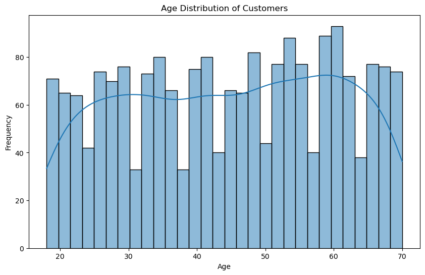
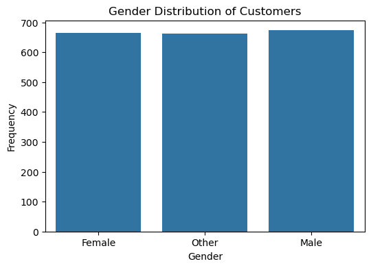
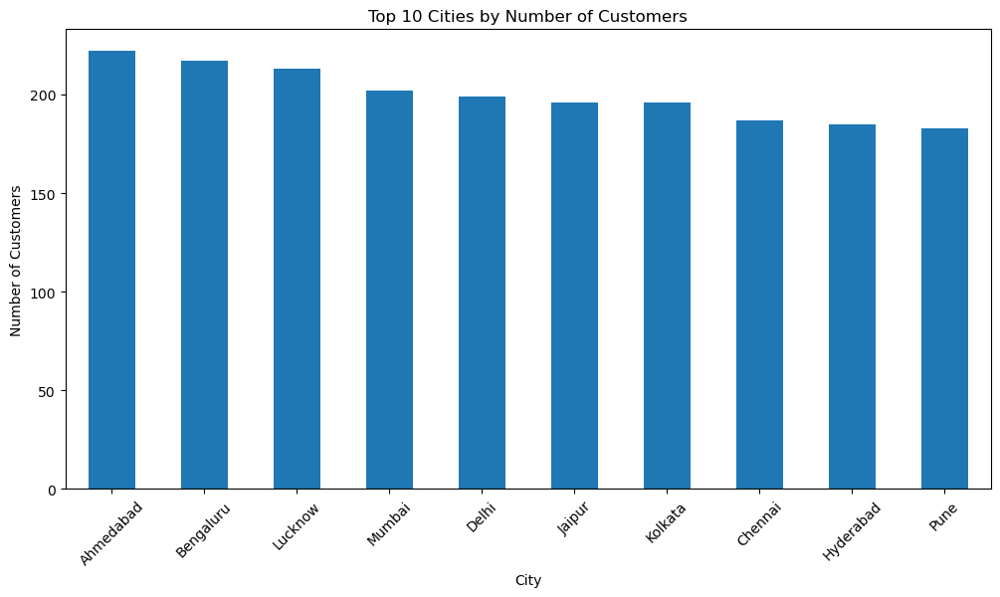
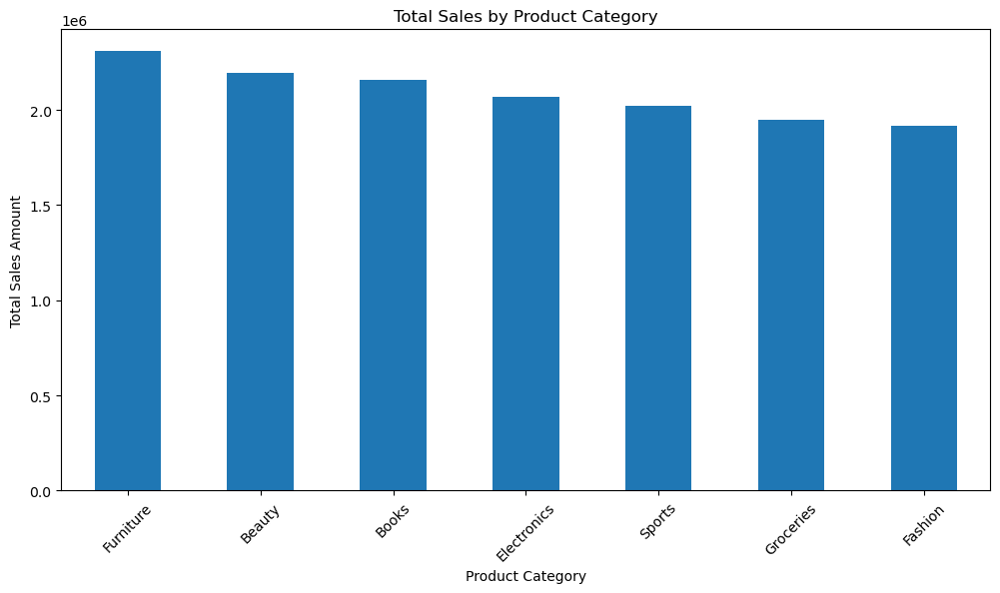
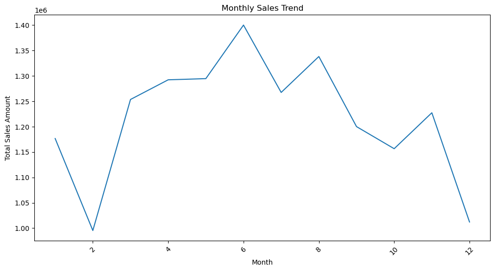
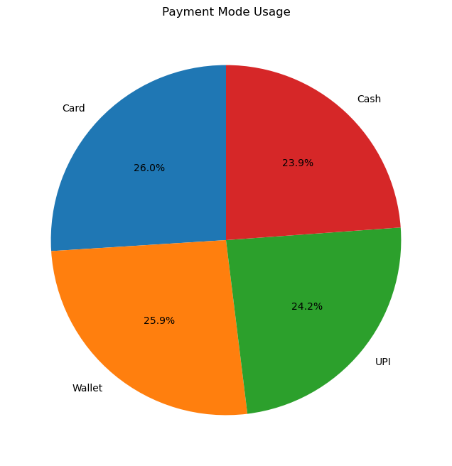
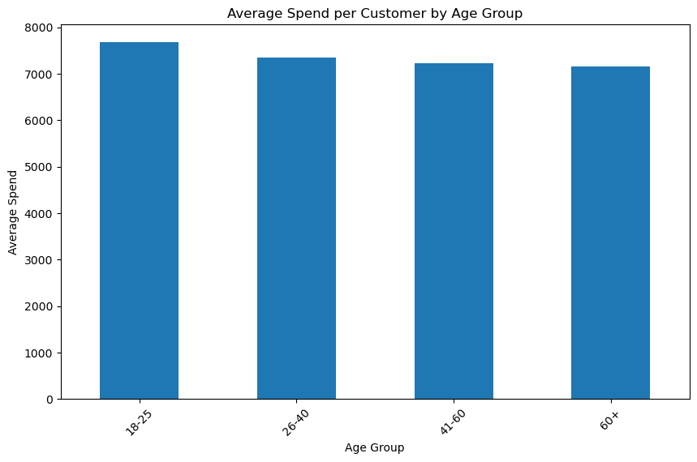
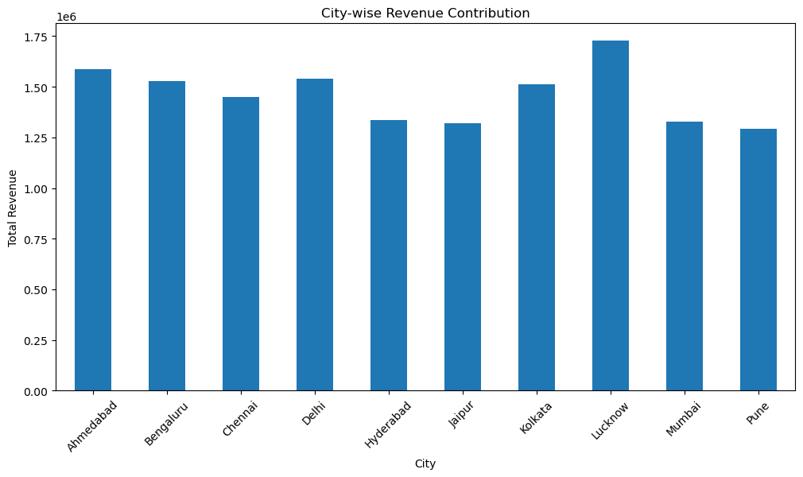
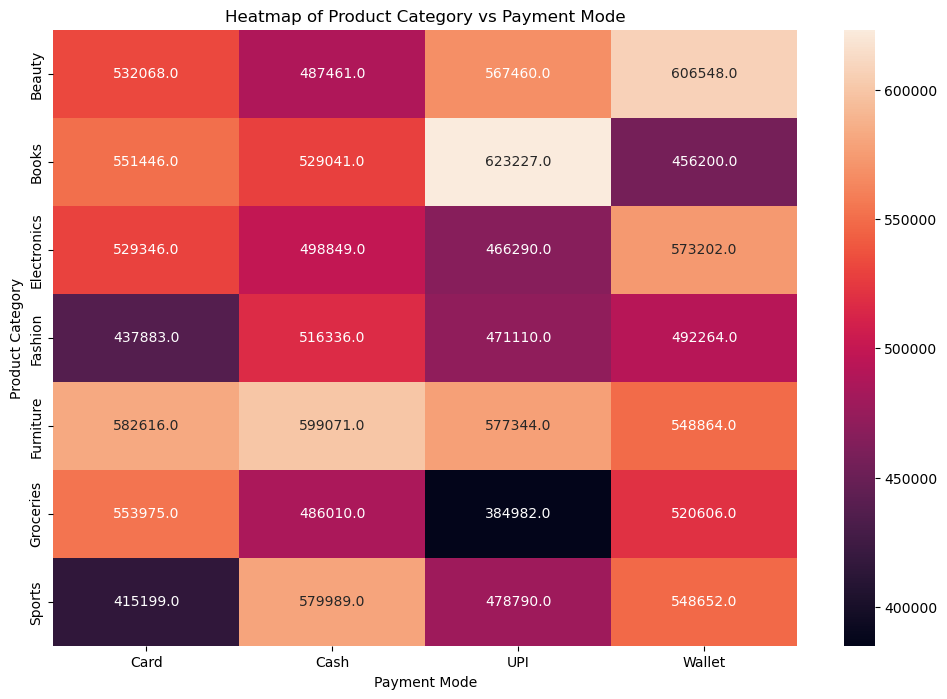

# 🛒 Retail Transactions – Preprocessing & Analysis  

## 📌 Business Scenario  
A retail chain operating across multiple cities in India wants to improve its decision-making by analysing **customer purchase behaviour**.  
With expansion into Tier-2 and Tier-3 cities, the company faces challenges in understanding:  

- Customer preferences  
- Seasonal demand patterns  
- City-level sales performance  

However, the **raw transaction data** is messy, incomplete, and inconsistent, making direct analysis difficult.  

The goal of this project is to **preprocess, clean, and visualize** the data to uncover meaningful insights for **marketing and inventory decisions**.  

---

## 📂 Dataset Overview  

**File:** `Retail_Transactions_2000.csv`  
**Records:** ~2000 transactions (sample from 10,000+)  

| Column | Description |
|--------|-------------|
| TransactionID | Unique ID for each transaction |
| CustomerID | Unique ID for customers |
| Gender | Male / Female / Other |
| Age | Age of customer |
| City | City where purchase happened |
| ProductCategory | Electronics, Fashion, Groceries, Furniture, etc. |
| Quantity | Units purchased |
| Price | Price per unit (₹) |
| TotalAmount | Derived column (Quantity × Price) |
| PurchaseDate | Date of purchase |
| PaymentMode | Cash, Card, UPI, Wallet |

---

## 🛠 Part A: Data Preprocessing  

### 1. Data Inspection  
✔️ Checked dataset size, structure, and column details  
✔️ Identified missing values, duplicates, and inconsistent entries  

### 2. Handling Missing Data  
- Missing `Age` → replaced with mean/median  
- Missing `City` → replaced with mode (most frequent city)  
- Dropped rows with missing `TransactionID` or `ProductCategory`  

### 3. Data Cleaning  
- Removed duplicate transactions  
- Standardized categorical values (`m`, `MALE` → `Male`)  
- Fixed invalid values (`Quantity ≤ 0` or `Price ≤ 0`)  

### 4. Feature Engineering  
- Derived `TotalAmount` if missing  
- Extracted **Month** and **DayOfWeek** from `PurchaseDate`  
- Created **AgeGroup**:  
  - 18–25  
  - 26–40  
  - 41–60  
  - 60+  

### 5. Encoding & Transformation  
- Encoded categorical variables (`Gender`, `City`, `PaymentMode`)  
- Normalized numerical columns (`Age`, `Price`, `TotalAmount`) for analysis  

### 6. Final Verification  
- Verified dataset has **no missing/invalid values**  
- Exported final cleaned dataset → `Retail_Cleaned.csv`  

---

## 📊 Part B: Data Visualization  

### 1. Customer Demographics  
- **Age Distribution** of customers 
   
- **Gender Distribution** (bar chart)  
 
- **Top 10 Cities** by number of customers  
  

---

### 2. Sales Insights  
- **Total Sales by Product Category** (bar chart) 
  
- **Monthly Sales Trend** (line chart)  
  
- **Payment Mode Usage** (pie chart)  
  

---

### 3. Advanced Insights  
- **Average Spend per Customer by Age Group**  
  
- **City-wise Revenue Contribution** (bar chart)  

- **Heatmap of Product Category vs Payment Mode**  
  

---

## 🎯 Expected Learning Outcomes  
- Understand **real-world challenges** in raw retail data  
- Learn **step-by-step preprocessing** (cleaning, missing values, encoding, feature engineering)  
- Develop **data visualization skills** for business storytelling  
- Build confidence in creating **business-ready datasets**  

---

## 📁 Repository Structure  

```
Retail_Transactions-Preprocessing-analysis/
│── images/
│   ├── age_distribution.png
│   ├── gender_distribution.png
│   ├── sales_by_category.png
│   └── ...
│
│── data_preprocess.ipynb
│── data_visualize.ipynb
│── Retail_Transactions_2000.csv
│── Retail_Cleaned.csv
│── requirements.txt
│── README.md
```

---

## 🚀 How to Run  

1. Clone the repo  
```bash
git clone https://github.com/Gokul-bit165/Retail_Transactions-Preprocessing-analysis.git
cd Retail_Transactions-Preprocessing-analysis
```

2. Install dependencies  
```bash
pip install -r requirements.txt
```

3. Run preprocessing  
```bash
jupyter notebook data_preprocess.ipynb
```

4. Run visualization  
```bash
jupyter notebook data_visualize.ipynb
```
